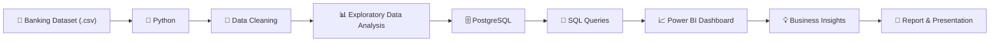
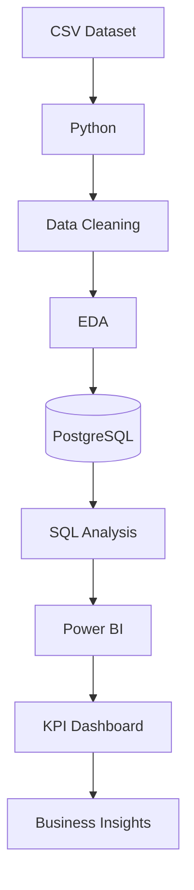

# 🏦 Banking Data Analytics Project

<p align="center">

# End-to-End Banking Analytics using Python • PostgreSQL • SQL • Power BI

An end-to-end Data Analytics project demonstrating the complete analytics lifecycle from raw banking data to business insights using **Python, PostgreSQL, SQL, Power BI, Excel, and Jupyter Notebook**.

</p>

---

## 📊 Dashboard Preview

> Replace the image below with a screenshot of your Power BI dashboard.

<p align="center">

</p>

---

# 📌 Project Overview

This project simulates a real-world Banking Data Analytics workflow used by data analysts in financial organizations.

The dataset is first cleaned and analyzed in Python, stored inside PostgreSQL, queried using SQL, and finally visualized through an interactive Power BI dashboard to support business decision-making.

---

# 🎯 Business Objectives

- Analyze customer loan and deposit behaviour
- Identify high-value customer segments
- Measure banking KPIs
- Perform geographic analysis
- Generate actionable business insights
- Build an executive dashboard

---

# 📂 Dataset

The dataset contains information including:

- Customer Details
- Income Band
- Nationality
- Loan Amount
- Deposit Amount
- Savings Account
- Checking Account
- Credit Card Accounts
- Foreign Currency Holdings
- Banking Fees
- Customer Relationships

---

# ⚙️ Technology Stack

| Technology | Purpose |
|------------|---------|
| Python | Data Cleaning & Analysis |
| Pandas | Data Manipulation |
| NumPy | Numerical Computing |
| Matplotlib | Visualization |
| PostgreSQL | Database |
| SQL | Business Queries |
| Power BI | Dashboard |
| Excel | Validation |
| Jupyter Notebook | Development |

---

# 🔄 Project Workflow



---

# 🏗️ Project Architecture



---

# 📁 Repository Structure

```text
🏦 Banking-Data-Analytics
│
├── 📂 Data
│   ├── Banking.csv
│   └── Banking.xlsx
│
├── 📂 Notebook
│   └── BankEDA.ipynb
│
├── 📂 SQL
│   └── Banking_SQL_Queries.sql
│
├── 📂 Dashboard
│   └── Banking Dashboard.pbix
│
├── 📂 Reports
│   └── Banking_Report.pdf
│
├── 📂 Presentation
│   └── Banking_Presentation.pptx
│
├── 📂 Assets
│   ├── dashboard.png
│   ├── workflow.png
│   └── architecture.png
│
├── requirements.txt
├── README.md
└── LICENSE
```

---

# 🧹 Data Preprocessing

- Removed duplicates
- Handled missing values
- Standardized column names
- Converted data types
- Prepared dataset for PostgreSQL
- Validated cleaned data

---

# 📊 Exploratory Data Analysis

Performed analysis on:

- Loan Distribution
- Deposit Distribution
- Income Band
- Customer Segmentation
- Nationality Analysis
- Banking Relationships
- Correlation Analysis
- Outlier Detection

---

# 🗄️ PostgreSQL Database

The cleaned dataset was imported into PostgreSQL for structured storage and querying.

Key SQL concepts demonstrated:

- SELECT
- WHERE
- GROUP BY
- ORDER BY
- CASE WHEN
- Aggregate Functions
- Window Functions
- CTEs
- Joins

---

# 📈 Power BI Dashboard

The dashboard provides:

- Executive KPI Cards
- Loan Analysis
- Deposit Analysis
- Income Band Analysis
- Geographic Analysis
- Customer Segmentation
- Financial Goals
- Interactive Filters

---

# 📌 Key Performance Indicators

- 👥 Total Clients
- 💰 Total Loan Amount
- 🏦 Total Deposit Amount
- 💳 Credit Card Accounts
- 🤝 Engagement Accounts
- 💵 Total Fees
- 🌍 Foreign Currency Holdings

---

# 💡 Business Insights

- Mid-income customers contribute the highest loan volume.
- European customers account for the largest share of banking activity.
- Lending exceeds deposits, highlighting a lending-focused portfolio.
- Geographic segmentation supports targeted marketing strategies.
- Interactive dashboards simplify executive decision-making.

---

# 🚀 Skills Demonstrated

- Data Cleaning
- Data Wrangling
- Exploratory Data Analysis
- PostgreSQL
- SQL
- Database Management
- KPI Development
- Dashboard Design
- Business Intelligence
- Data Storytelling
- Data Visualization

---

# ▶️ How to Run

```bash
git clone https://github.com/yourusername/Banking-Data-Analytics.git
cd Banking-Data-Analytics
pip install -r requirements.txt
```

1. Open `BankEDA.ipynb` and execute all cells.
2. Import the cleaned data into PostgreSQL.
3. Run the SQL queries.
4. Open `Banking Dashboard.pbix` in Power BI Desktop.
5. Explore the dashboard.

---

# 📈 Future Improvements

- Predictive Loan Default Model
- Customer Churn Prediction
- Automated ETL Pipeline
- Live PostgreSQL Connection
- Cloud Deployment
- Real-Time Dashboard

---

# 👨‍💻 Author

**R. Akshith Reddy**

B.Tech, Chemical Engineering  
National Institute of Technology Warangal

**Aspiring Data Analyst**

### Skills

Python • SQL • PostgreSQL • Power BI • Excel • Pandas • NumPy • Data Visualization • Business Intelligence

---

## ⭐ If you found this project useful, consider giving it a star!
